# GitHub Contribution Minesweeper




Turn your GitHub contribution heatmap into a Minesweeper board.
Low contribution days are more likely to hide mines, active days are usually safer. Includes advanced auto-solver, replay, and exportable animated SVG.

## Features

- Weighted mine placement based on contribution counts (configurable ratio, default 0.1)
- First click always safe + zero-area flood expansion
- Advanced solving: basic rules + subset difference inference + small frontier state enumeration + probabilistic lowest-risk guessing
- Replay with progress bar
- Export static board SVG and animated replay SVG (looping + speed control 0.25x ~ 32x)
- Light / Dark themes
- Original contribution heatmap with month / week labels
- Strict mode: disable mock fallback if GitHub fetch fails

## Usage (website)

1. Serve the folder with any static server (VS Code Live Server / Five Server etc.). [Demo](https://xiang511.com/GitHub-Contribution-Minesweeper/index.html)
2. Enter a GitHub username.
3. (Optional) Enter a year (e.g. 2024) → uses Jan 1 ~ Dec 31 of that year (normalized); leave empty for trailing 52 weeks.
4. Adjust mine ratio.
5. Enable Strict Mode to forbid mock data (fetch failure will error out).
6. Click Load / Rebuild.
7. Left click to reveal, right click to flag.
8. Control buttons:
   - Auto Step: one inference pass
   - Auto Run: repeated basic inference
   - Auto Solve: advanced solver until completion
   - Replay: play back last auto-solve actions (uses speed select)
   - Export Board SVG: current static board
   - Export Replay SVG: animated SVG (loop capable)
9. Speed select controls both replay pacing and exported animation step duration.

## Usage (NPM / CLI)

You can install the CLI to directly generate a board SVG or an auto-solve replay animation.

```
npm install github-contribution-minesweeper
```

Generate static board SVG to a file:

```
gh-contrib-minesweeper -u xiang511 --out board.svg
```

Generate looping animation SVG:

```
gh-contrib-minesweeper -u xiang511 --animation --anim-out replay.svg
```

Pipe to stdout (no --out):

```
gh-contrib-minesweeper -u xiang511 > board.svg
```

### CLI Options

| Flag             | Default       | Description                                       |
| ---------------- | ------------- | ------------------------------------------------- |
| `-u, --username` | (required)    | GitHub username                                   |
| `--ratio`        | 0.1           | Mine ratio 0.01~0.5                               |
| `--year`         | none          | Use calendar year (overrides trailing)            |
| `--no-trailing`  | false         | Disable trailing 52 weeks normalization           |
| `--theme`        | light         | `light` or `dark`                                 |
| `--lighten`      | 0.45          | Lighten factor for revealed safe cells            |
| `--mock`         | true          | Use mock data on fetch failure                    |
| `--out`          | stdout        | Output file for static board                      |
| `--animation`    | false         | Generate animation instead of static board        |
| `--anim-out`     | animation.svg | Output file for animation SVG                     |
| `--step-seconds` | 1             | Seconds per logical action (animation)            |
| `--fade`         | 0.25          | Fade duration for cell appearance (animation)     |
| `--speed`        | 1             | Speed multiplier (divides step-seconds & fade)    |
| `--seq-flood`    | false         | Sequential flood reveal (default simultaneous)    |
| `--no-loop`      | false         | Disable animation looping                         |
| `--source`       | auto          | Data source: auto(api→html→mock), api, html, mock |

### Programmatic Usage

```js
import {
  generateBoardSVG,
  generateAnimationSVG,
} from "github-contribution-minesweeper";

const boardSvg = await generateBoardSVG({
  username: "xiang511",
  ratio: 0.12,
  theme: "dark",
});
const animSvg = await generateAnimationSVG({
  username: "xiang511",
  theme: "light",
  stepSeconds: 0.5,
});
```

Option docs are also exported as `OPTION_DOC`.

### Data Source Notes

`--source auto` (default) tries public API (grubersjoe) first for accuracy, then falls back to HTML scraping, then mock if allowed. 

`--source api` to force API only (may fail on rate limits), or `--source html` to bypass API. 

`--source mock` always generates synthetic data.


## Solver Logic Summary

- Basic: if number = flagged → open others; if flagged + hidden = number → flag hidden.
- Subset Difference: If constraint A ⊆ B and same mine count → (B \ A) safe; if (B.mines - A.mines) = |B \ A| then (B \ A) all mines.
- Group Enumeration: Merge overlapping constraints, enumerate groups with ≤12 unknowns, count valid assignments for probabilities.
- Probabilistic Guess: pick cell with lowest mine probability (tie-break: farther from center / random), reducing forced blind luck.

## Development Notes

#### Project Structure

```
index.html                # UI + controls
svg-creator.js            # Board + animation SVG generation / export
minesweeper-types.js      # Data structures + reveal / flag logic
auto-player.js            # Auto solver, inference, replay action logging
github-integration.js     # Contribution fetch + normalization
contributions-chart.js    # Contribution heatmap rendering
```

#### Advanced Animation Options (exportReplayAnimation)

| Option              | Default | Description                                                        |
| ------------------- | ------- | ------------------------------------------------------------------ |
| `stepSeconds`       | 1       | Seconds per logical step (UI maps speed = 1/stepSeconds)           |
| `fadeDuration`      | 0.25    | Color / text fade-in duration per step                             |
| `simultaneousFlood` | true    | If true flood reveals appear together; false = staggered           |
| `lightenFactor`     | 0.45    | Blend factor for revealed safe cells toward theme background (0~1) |
| `loop`              | true    | Auto replay animation                                              |


## Inspiration / References

- [GitHub Mines Browser Extension](https://github.com/bgonp/github-mines-extension)
- [GitHub Contributions API v4](https://github.com/grubersjoe/github-contributions-api)
- [snk](https://github.com/Platane/snk)

## License

This project is published under Apache-2.0 license
